# 🎨 Employee Management Frontend (SAPUI5 / Fiori)

This is the frontend module of the **Employee Management Application**, built using **SAPUI5**, following the **Fiori Master–Detail application pattern**. The frontend consumes the backend OData service exposed by CAP.

---

## 📌 1. Overview
The UI allows users to:
- View employees in a responsive table
- Filter employees using a custom Filter Dialog
- Sort employees by fields
- Create, Update, Delete employees using dialogs
- View full record in Detail Page
- Navigate using Fiori router
- Batch Delete multiple employees
- Upload Excel → Preview Table → Batch Create employees
- Export table data to PDF

---

## 📁 2. Frontend Project Structure
```
app/employee-ui/
│
├── webapp/
│   ├── view/
│   ├── controller/
│   ├── model/
│   ├── util/
│   ├── i18n/
│   ├── manifest.json
│   └── Component.js
```

---

## 🧭 3. Application Architecture (Master–Detail)

### ✅ Dashboard
The Dashboard Page serves as the landing page of the Employee Management Application. It provides a clean and intuitive starting point for users before navigating into the Master–Detail UI

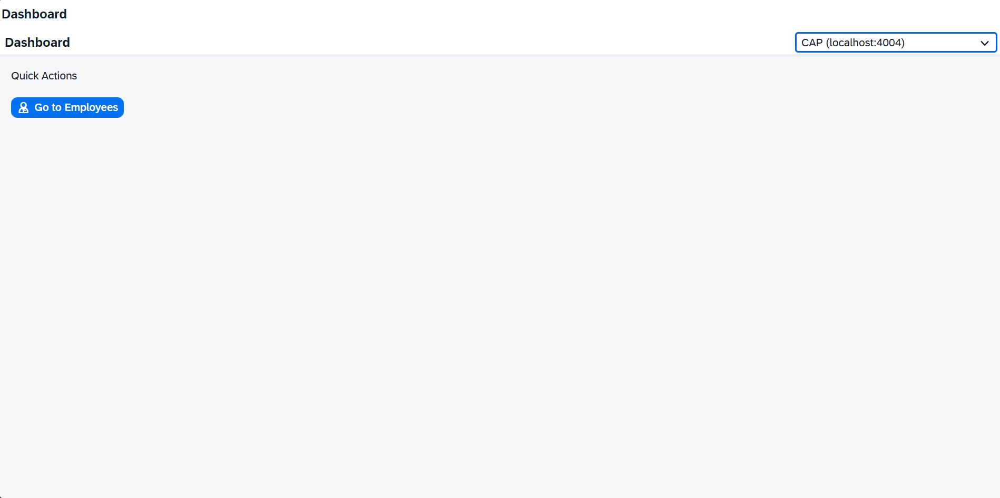

### ✅ Master Page
Displays list of employees,Add new Employee, filter & sort options.

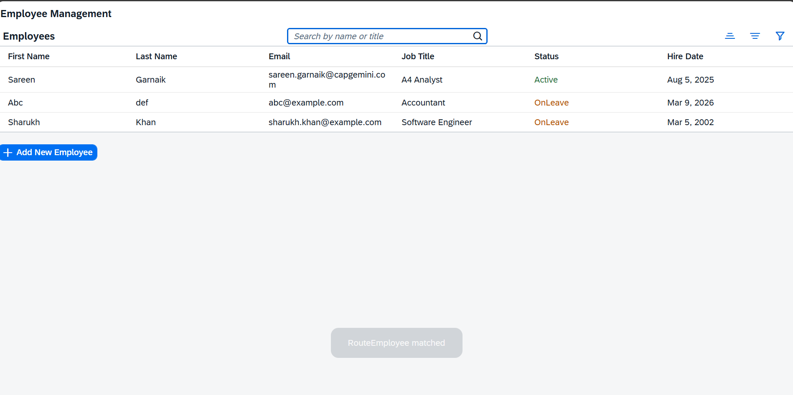

### ✅ Detail Page
Shows full details & operations.

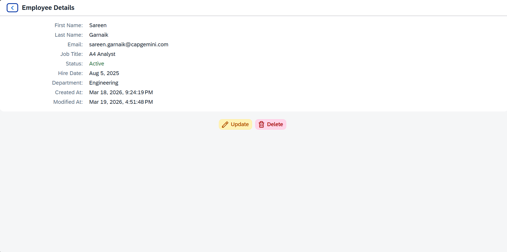

---

## 🏗 4. Routing (manifest.json)
```
{
  "routes": [
    { "name": "RouteDashboard", "pattern": "", "target": "TargetDashboard" },
    { "name": "RouteEmployee", "pattern": "RouteEmployee", "target": "TargetEmployee" },
    { "name": "RouteEmployeeDetails", "pattern": "RouteEmployeeDetails({ID})", "target": "TargetEmployeeDetails" }
  ],

  "targets": {
    "TargetDashboard":       { "id": "Dashboard",       "name": "Dashboard" },
    "TargetEmployee":        { "id": "Employee",        "name": "Employee" },
    "TargetEmployeeDetails": { "id": "EmployeeDetails", "name": "EmployeeDetails" }
  }
}
```
---

## ✨ 5. Features

### ✅ Employee Table
Fully responsive table bound to OData.  
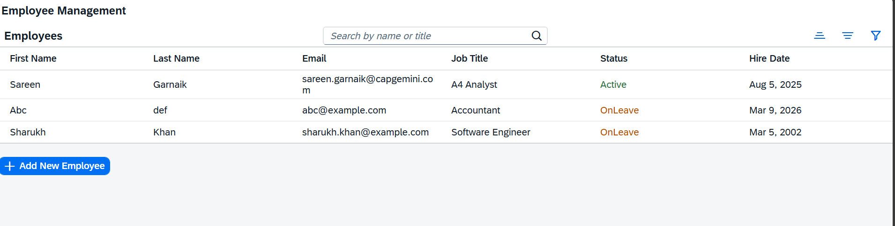

---

### ✅ Create Employee Dialog
Form fields: FirstName, LastName, Email, JobTitle, Department, Status.  
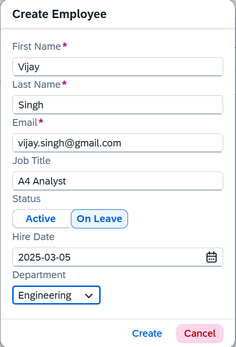

---

### ✅ Edit Employee Dialog
Pre-filled update dialog.  
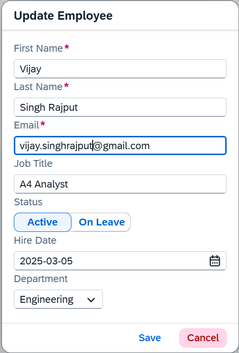

---


---

### ✅ Delete Confirmation
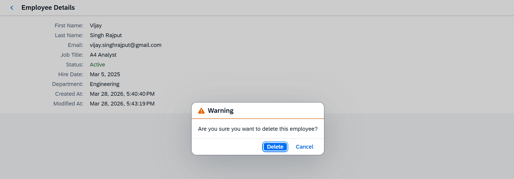

---

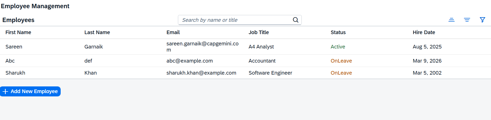

---

### ✅ Batch Delete
Allows selecting multiple employees and deleting them together in one operation.  
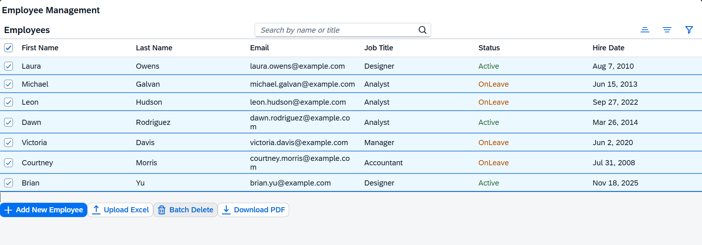

---

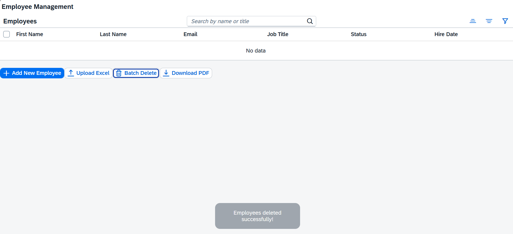

---

### ✅ Excel → Table → Batch Create
Upload Excel file → preview parsed data in a table → confirm → batch create in backend.  
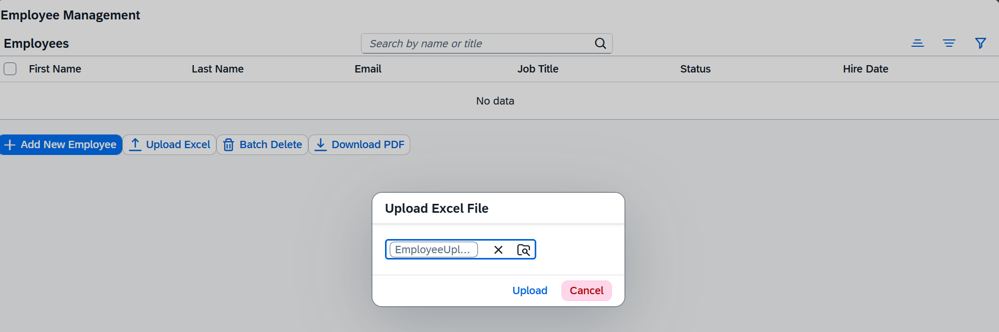

---

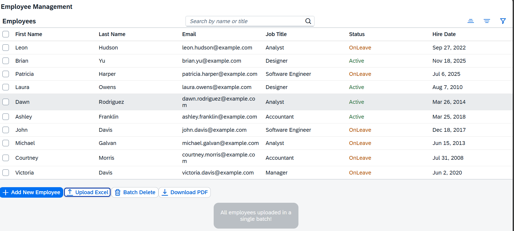

---

### ✅ Export Table to PDF
Exports the currently visible table (after filters/sorting) to a downloadable PDF document. 

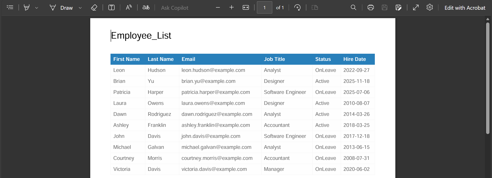

---

## 🔍 6. Filter Dialog
Allows filtering by First Name & Job Title.

```
_applyFilter() {
  const aFilters = [];
  ...
  this.byId("myTable").getBinding("items").filter(aFilters);
}
```

---

## 🔄 7. Sorting
```
applySort(path, ascending) {
  const sorter = new sap.ui.model.Sorter(path, ascending);
  this.byId("myTable").getBinding("items").sort(sorter);
}
```
➡️ *Paste screenshot of required image here*

---

## 🔽 8. OData Model Connection
```
"dataSources": {
  "employeeService": {
    "uri": "/employee/",
    "type": "OData",
    "settings": { "odataVersion": "4.0" }
  }
}
```

---

## 🧪 9. How to Run
```
npm start
npm run watch-employee-ui
```
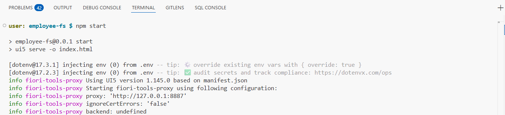

---

## ✅ 10. Recommended Screenshots
- Master Page
- Detail Page
- Create Dialog
- Edit Dialog
- Delete Confirmation
- Filter Dialog
- Sorting
- OData Metadata
- BAS Folder Structure

---

## ✅ 11. Next Steps
- Excel → Table Upload
- Table → PDF Export
- Role-based UI restrictions

---

## ✅ 12. Conclusion[text](webapp/controller)
This documentation describes the SAPUI5 frontend of the Employee Management System.
